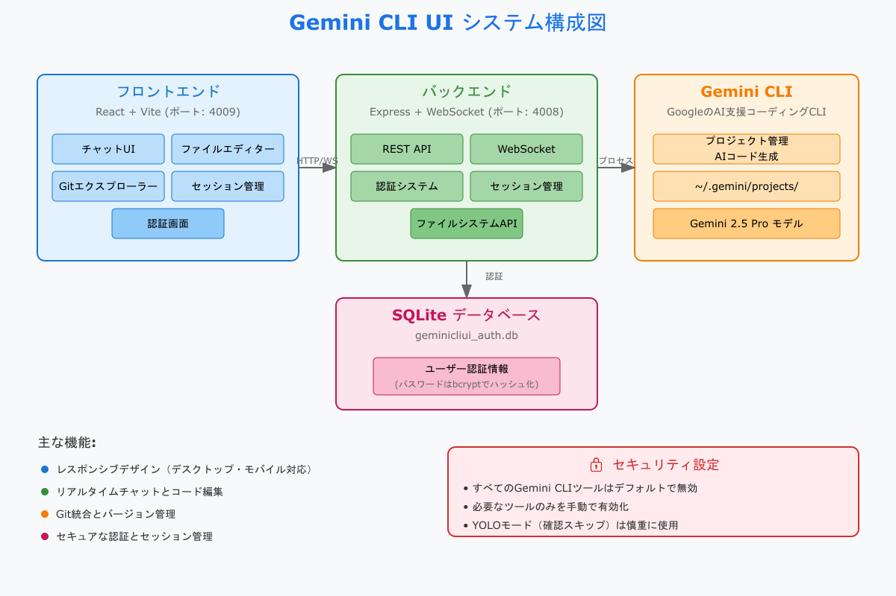

# easy-llm-cli-ui

<div align="center">
  
  <h1>easy-llm-cli-ui</h1>
</div>

[Gemini CLI](https://github.com/google-gemini/gemini-cli)
Google の AI 支援コーディング用公式 CLI のデスクトップ・モバイル対応 UI です。ローカルまたはリモートで使用でき、Gemini
CLI のアクティブなプロジェクトとセッションを表示し、CLI と同じように変更を加えることができます。どこでも動作する適切なインターフェースを提供します。

## Screenshots

<div align="center">
<table>
<tr>
<td align="center">
<h3>Chat View</h3>

<br>
<em>Main interface showing project overview and chat</em>
</td>
<td align="center">
<h3>Setting</h3>

<br>
<em>Setting</em>
</td>
</tr>
</table>
<table>
<tr>
<td align="center">
<h3>Chat View</h3>

<br>
<em>easy-llm-cli-ui Diagram</em>
</td>
</table>
</div align="center">

## 機能

- **レスポンシブデザイン** -
  デスクトップ、タブレット、モバイルでシームレスに動作し、モバイルからも Gemini
  CLI を使用可能
- **インタラクティブなチャットインターフェース** - Gemini
  CLI とのシームレスな通信のための組み込みチャットインターフェース
- **統合シェルターミナル** - 組み込みシェル機能による Gemini CLI への直接アクセス
- **ファイルエクスプローラー** -
  シンタックスハイライトとライブ編集機能を備えたインタラクティブなファイルツリー
- **Git エクスプローラー** -
  変更の表示、ステージング、コミット。ブランチの切り替えも可能
- **セッション管理** - 会話の再開、複数セッションの管理、履歴の追跡
- **モデル選択** - Gemini 2.5 Pro を含む複数の Gemini モデルから選択可能
- **YOLO モード** - 確認プロンプトをスキップして高速操作（注意して使用）

## クイックスタート

### 前提条件

- [Node.js](https://nodejs.org/) v20 以上
- [Gemini CLI](https://github.com/google-gemini/gemini-cli)がインストールされ、設定済みであること

### インストール

1. **リポジトリをクローン：**

```bash
git clone https://github.com/masx200/easy-llm-cli-ui.git
cd geminicliui
```

2. **依存関係をインストール：**

```bash
npm install
```

3. **環境設定：**

```bash
cp .env.example .env
# お好みの設定で.envを編集
```

**注意**:
`.env`ファイルはセキュリティのため削除されています。使用時は必ず`.env.example`をコピーして`.env`を作成し、必要に応じて設定を変更してください。

4. **アプリケーションを起動：**

```bash
# 開発モード（ホットリロード付き）
npm run dev
```

アプリケーションは.env で指定したポートで起動します

5. **ブラウザを開く：**
   - 開発環境: `http://localhost:4009`

## セキュリティとツール設定

**🔒 重要なお知らせ**: すべての Gemini
CLI ツールは**デフォルトで無効**になっています。これにより、潜在的に有害な操作が自動的に実行されることを防ぎます。

### ツールの有効化

Gemini CLI の全機能を使用するには、手動でツールを有効にする必要があります：

1. **ツール設定を開く** - サイドバーの歯車アイコンをクリック
2. **必要に応じて有効化** - 必要なツールのみをオンにする
3. **設定を適用** - 設定はローカルに保存されます

### YOLO モードについて

YOLO モード（「You Only Live Once」）は、Gemini CLI の `--yolo`
フラグに相当し、すべての確認プロンプトをスキップします。このモードは作業を高速化しますが、注意して使用してください。

**推奨アプローチ**:
基本的なツールから始めて、必要に応じて追加していきます。設定はいつでも調整できます。

## 使用ガイド

### コア機能

#### プロジェクト管理

UI は `~/.gemini/projects/` から Gemini
CLI プロジェクトを自動的に検出し、以下を提供します：

- **ビジュアルプロジェクトブラウザー** -
  メタデータとセッション数を含むすべての利用可能なプロジェクト
- **プロジェクトアクション** - プロジェクトの名前変更、削除、整理
- **スマートナビゲーション** -
  最近のプロジェクトとセッションへのクイックアクセス

#### チャットインターフェース

- **レスポンシブチャットまたは Gemini CLI を使用** -
  適応されたチャットインターフェースを使用するか、シェルボタンを使用して Gemini
  CLI に接続できます
- **リアルタイム通信** - WebSocket 接続による Gemini からのストリームレスポンス
- **セッション管理** - 以前の会話を再開するか、新しいセッションを開始
- **メッセージ履歴** - タイムスタンプとメタデータを含む完全な会話履歴
- **マルチフォーマットサポート** - テキスト、コードブロック、ファイル参照
- **画像添付** - チャットで画像をアップロードして質問可能

#### ファイルエクスプローラーとエディター

- **インタラクティブファイルツリー** -
  展開/折りたたみナビゲーションでプロジェクト構造を閲覧
- **ライブファイル編集** -
  インターフェース内で直接ファイルを読み取り、変更、保存
- **シンタックスハイライト** - 複数のプログラミング言語をサポート
- **ファイル操作** - ファイルとディレクトリの作成、名前変更、削除

#### Git エクスプローラー

- **変更の可視化** - 現在の変更をリアルタイムで表示
- **ステージングとコミット** - UI から直接 Git コミットを作成
- **ブランチ管理** - ブランチの切り替えと管理

#### セッション管理

- **セッション永続性** - すべての会話を自動的に保存
- **セッション整理** - プロジェクトとタイムスタンプでセッションをグループ化
- **セッションアクション** - 会話履歴の名前変更、削除、エクスポート
- **クロスデバイス同期** - どのデバイスからでもセッションにアクセス

### モバイルアプリ

- **レスポンシブデザイン** - すべての画面サイズに最適化
- **タッチフレンドリーインターフェース** -
  スワイプジェスチャーとタッチナビゲーション
- **モバイルナビゲーション** - 簡単な親指ナビゲーションのための下部タブバー
- **適応レイアウト** -
  折りたたみ可能なサイドバーとスマートコンテンツの優先順位付け
- **ホーム画面にショートカットを追加** -
  ホーム画面にショートカットを追加すると、アプリは PWA のように動作します

## アーキテクチャ

### システム概要

```
┌─────────────────┐    ┌─────────────────┐    ┌─────────────────┐
│   フロントエンド   │    │   バックエンド    │    │  Gemini CLI     │
│   (React/Vite)  │◄──►│ (Express/WS)    │◄──►│  統合           │
└─────────────────┘    └─────────────────┘    └─────────────────┘
```

### バックエンド（Node.js + Express）

- **Express サーバー** - 静的ファイルサービングを備えた RESTful API（ポート:
  4008）
- **WebSocket サーバー** - チャットとプロジェクト更新のための通信
- **Gemini CLI 統合** - プロセスの生成と管理
- **セッション管理** - JSONL パースと会話の永続化
- **ファイルシステム API** - プロジェクト用のファイルブラウザーを公開
- **認証システム** - セキュアなログインとセッション管理（SQLite データベース:
  geminicliui_auth.db）

### フロントエンド（React + Vite）

- **React 18** - フックを使用したモダンなコンポーネントアーキテクチャ
- **CodeMirror** - シンタックスハイライト付きの高度なコードエディター
- **Tailwind CSS** - ユーティリティファーストの CSS フレームワーク
- **レスポンシブデザイン** - モバイルファーストのアプローチ

## 設定詳細

### ポート設定

- **API サーバー**: 4008 番ポート（デフォルト）
- **フロントエンド開発サーバー**: 4009 番ポート（デフォルト）
- これらのポートは`.env`ファイルで変更可能です

### データベース設定

#### 初期設定とテーブル構造

- **データベースファイル**: `server/database/geminicliui_auth.db`
- **データベースタイプ**: SQLite 3
- **初期化**: サーバー起動時に自動的に作成・初期化されます

#### ユーザーテーブル詳細

**テーブル名**: `geminicliui_users`

| カラム名        | データ型 | 制約                      | 説明                                     |
| --------------- | -------- | ------------------------- | ---------------------------------------- |
| `id`            | INTEGER  | PRIMARY KEY AUTOINCREMENT | ユーザーの一意識別子                     |
| `username`      | TEXT     | UNIQUE NOT NULL           | ログインユーザー名（メールアドレス推奨） |
| `password_hash` | TEXT     | NOT NULL                  | bcrypt でハッシュ化されたパスワード      |
| `created_at`    | DATETIME | DEFAULT CURRENT_TIMESTAMP | アカウント作成日時                       |
| `last_login`    | DATETIME | NULL                      | 最終ログイン日時                         |
| `is_active`     | BOOLEAN  | DEFAULT 1                 | アカウントの有効/無効状態                |

**インデックス**:

- `idx_geminicliui_users_username`: ユーザー名での高速検索用
- `idx_geminicliui_users_active`: アクティブユーザーのフィルタリング用

#### 初回起動時の設定

1. サーバー初回起動時、データベースファイルが存在しない場合は自動作成
2. `server/database/init.sql` からテーブル構造を読み込み
3. 初回アクセス時にユーザー登録画面が表示される
4. 最初のユーザーが管理者として登録される

#### セキュリティ機能

- パスワードは bcrypt でハッシュ化して保存
- JWT トークンベースの認証システム
- セッション管理とタイムアウト機能
- SQL インジェクション対策（プリペアドステートメント使用）

## トラブルシューティング

### よくある問題と解決策

#### "Gemini プロジェクトが見つかりません"

**問題**: UI にプロジェクトが表示されない、またはプロジェクトリストが空
**解決策**:

- Gemini CLI が適切にインストールされていることを確認
- 少なくとも 1 つのプロジェクトディレクトリで`gemini`コマンドを実行して初期化
- `~/.gemini/projects/`ディレクトリが存在し、適切な権限があることを確認

#### ファイルエクスプローラーの問題

**問題**: ファイルが読み込まれない、権限エラー、空のディレクトリ **解決策**:

- プロジェクトディレクトリの権限を確認（ターミナルで`ls -la`）
- プロジェクトパスが存在し、アクセス可能であることを確認
- 詳細なエラーメッセージについてサーバーコンソールログを確認
- プロジェクトスコープ外のシステムディレクトリにアクセスしようとしていないか確認

#### モデル選択が機能しない

**問題**: 選択したモデルが使用されない **解決策**:

- 設定でモデルを選択後、必ず「設定を保存」をクリック
- ブラウザのローカルストレージをクリアして再度設定
- チャット画面でモデル名が正しく表示されているか確認

## ライセンス

GNU General Public License v3.0 -
詳細は[LICENSE](LICENSE)ファイルを参照してください。

このプロジェクトはオープンソースであり、GPL
v3 ライセンスの下で自由に使用、変更、配布できます。

### オリジナルプロジェクト

このプロジェクトは[Claude Code UI](https://github.com/siteboon/claudecodeui)
(GPL v3.0)をベースにカスタマイズしています。

**主な変更点:**

- Claude CLI から Gemini CLI への対応変更
- 認証システムの追加（SQLite ベース）
- Gemini 専用のモデル選択機能
- 日本語対応の強化
- UI の調整と Gemini ブランディング

オリジナルの Claude Code UI プロジェクトに感謝します。

## 謝辞

### 使用技術

- **[Gemini CLI](https://github.com/google-gemini/gemini-cli)** -
  Google の公式 CLI
- **[React](https://react.dev/)** - ユーザーインターフェースライブラリ
- **[Vite](https://vitejs.dev/)** - 高速ビルドツールと開発サーバー
- **[Tailwind CSS](https://tailwindcss.com/)** -
  ユーティリティファーストの CSS フレームワーク
- **[CodeMirror](https://codemirror.net/)** - 高度なコードエディター

## サポートとコミュニティ

### 最新情報を入手

- このリポジトリに**スター**を付けてサポートを表明
- アップデートと新リリースを**ウォッチ**
- アナウンスのためにプロジェクトを**フォロー**

---
